# ⚽ Predictive Analysis of FIFA Player Wages

**Group Members:** Alina Huang, Pipat Gittisupab, Tvisha Modi, Tram Nguyen, Sandra Sunny

## 📌 Abstract

With the global growth of the football industry, the need for data-driven insights that could potentially drive informed decisions on player recruitment, team building, and financial investments is growing. This project aims to predict football player wages from their performance attributes using a comprehensive dataset scraped from FIFA. This dataset describes each player with 56 attributes, ranging from physical characteristics to technical skills and performance metrics. We used XGBoost for feature selection, ensuring that the most important features contributing to wage determination were identified. Several machine learning models, including XGBoost, Linear Regression, Random Forest, and SVR, were then trained and evaluated to find the best approach toward predicting wages. Results give insights into what factors most determine player wages and could be useful for football clubs, sports analysts, and financial stakeholders interested in player transfers.

## 🔍 Data Acquisition

Data for this study were collected through web scraping of player information from FIFA, which has the detailed attributes of each player in the game. We first scraped all the links to individual players from the directory pages (https://www.fifaindex.com/players/). We looped over 600 pages to collect the links to personal pages (e.g., Erling Haaland) of 18241 players in FIFA in 2024. One difficulty we faced was the variation in the layout of the player’s pages. For example, some players are associated with multiple teams (club and national teams), whereas others are only associated with one team. The website regularly uses the same layout for tags, which makes it difficult to handle varying numbers of tags and identify associated data. Through trial and error, we were able to collect the main metrics and data that are available for most of the players. 

Since the website uses Cloudflare to prevent web scraping, we downloaded the Chromium driver and experimented with Selenium and cloud scraper packages in Python to create a scraper that behaves like a regular browsing session. Eventually, we were able to scrape the data using Cloud Scraper and BeautifulSoup. 

The dataset comprises 86 variables per player, covering age, ratings, skills, physical attributes, positions, and performance metrics. Collected from FIFA's online repositories, it spans multiple seasons, capturing players' abilities and career trajectories. The data is structured into rows representing players and columns detailing their attributes.

## 📊 Exploratory Data Analysis and Feature Engineering

Initially, we used XGBoost to identify the top 20 most important features, applying the raw dataset as input (Figure 1). 

  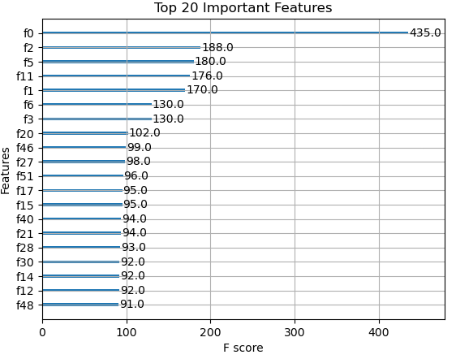

  <em>Figure 1: Top 20 Important Features by XGBoost Before Preprocessing.</em>

This resulted in a mean squared error (MSE) of 90.91 and an R2 value of 0.73. Next, we conducted exploratory data analysis (EDA) to examine the distribution of the dataset, with a particular focus on the target variable, wage, and other key features (e.g., age, scores) that we believe are strongly correlated with wages. Through EDA, we gained valuable insights into data distributions, feature relationships, and identified opportunities for feature engineering to enhance model performance. 

The wage variable, serving as the target, exhibited strong skewness with most values clustered in lower brackets. Missing wage data, critical as the dependent variable, was removed. To address skewness and stabilize variance, appropriate transformations were applied (Figure 2).

  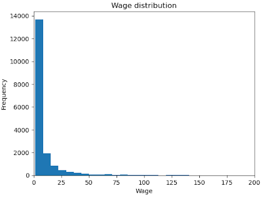

  <em>Figure 2: Raw Distribution of Wages.</em>

A log transformation was applied, which partially normalized the distribution but did not fully resolve the skewness (Figure 3). A square root transformation provided the best empirical results in reducing skewness (Figure 4), followed by a Box-Cox transformation, which further stabilized variance and enhanced normality for positive-valued data (Figure 5). Lastly, a Yeo-Johnson transformation was performed using scikit-learn's PowerTransformer, handling both positive and negative values and producing a symmetric distribution (Figure 6). Ultimately, the square root transformation was selected as the most effective in mitigating skewness, and the model was trained to predict square-rooted wages.

  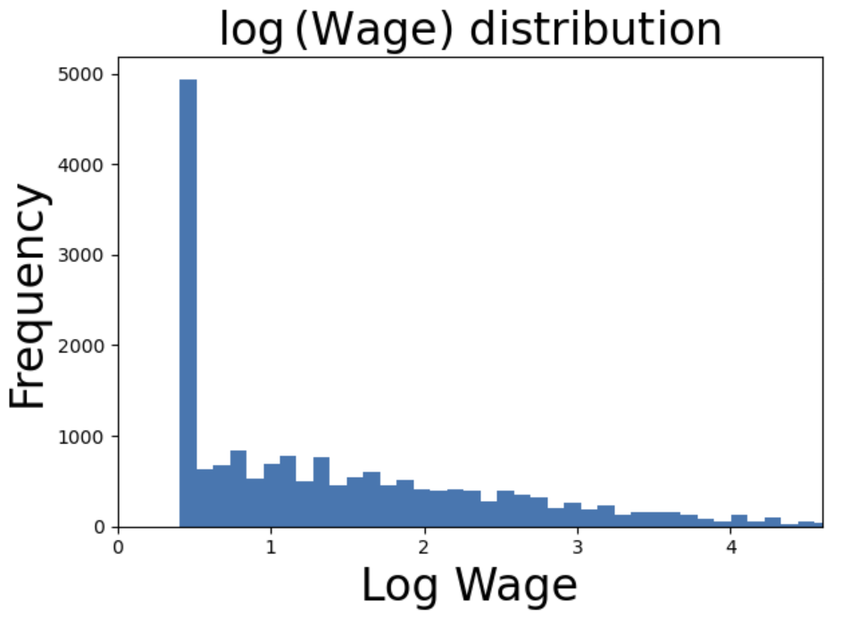
  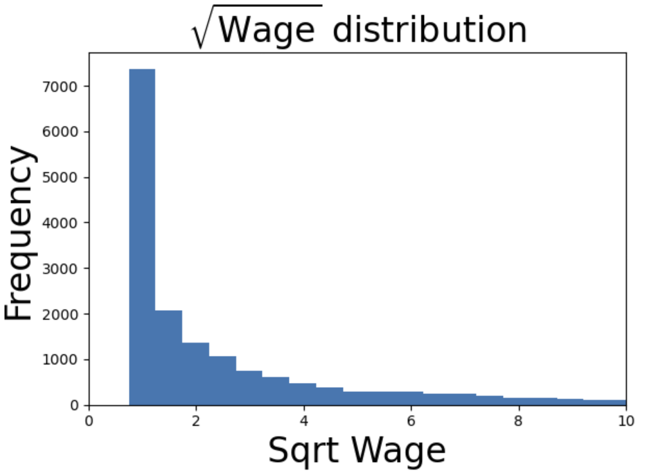
  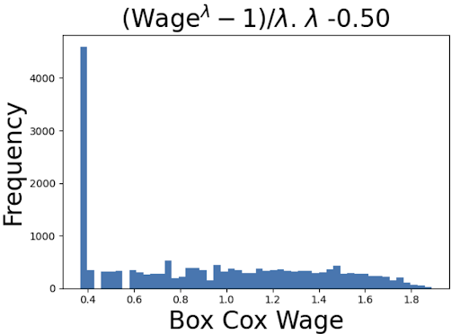
  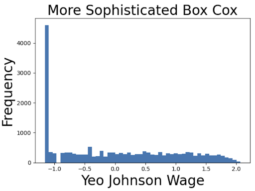

  <em>Figure 3–6: Target variable transformations to reduce skewness.</em>

The feature analysis process involved examining key features to understand their distributions and determine the need for preprocessing. The analysis revealed several insights for feature engineering. The age histogram showed a concentration of players in the 20–30 age range, prompting the categorization of age into groups [0–20, 20-40, 40+], with players aged 20-40 assigned a value of 1 to reflect their prime years, which improved model performance (Figure 7). 

  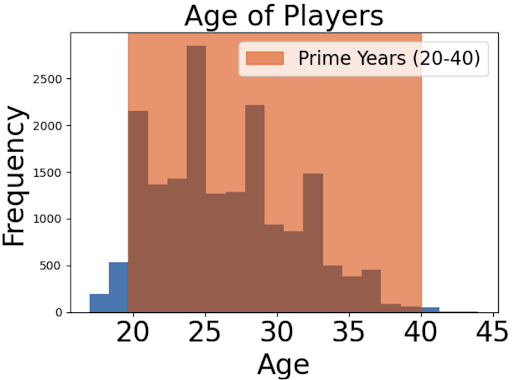

  <em>Figure 7: Age Distribution.</em>

The height distribution, centered around 180 cm, suggested that taller players (above 180 cm) might excel in heading skills, so they were assigned a value of 1, with shorter players assigned zero, further enhancing model performance (Figure 8). Missing height data was replaced with the mean value.

  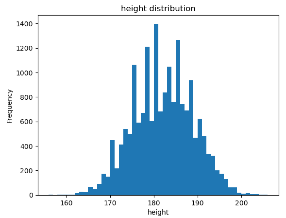

  <em>Figure 8: Height Distribution.</em>

The weight distribution was normally distributed, and to account for extreme weights potentially impacting performance, indicator variables were added for players with weights below 70 kg or above 90 kg, with missing values replaced by the mean (Figure 9). 

  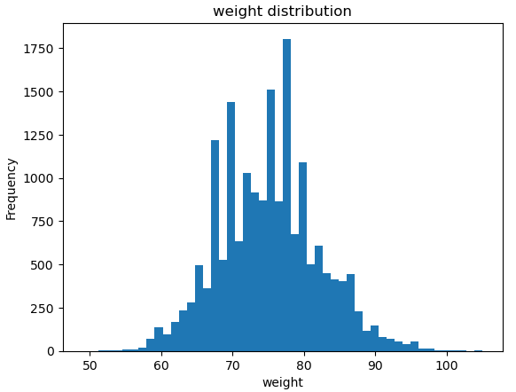

  <em>Figure 9: Weight Distribution.</em>

Features like Ball Control, Dribbling, Slide Tackle, and Stand Tackle exhibited bimodal distributions (Figure 10-13), leading to the creation of binary columns based on threshold values to represent low and high performances. 

  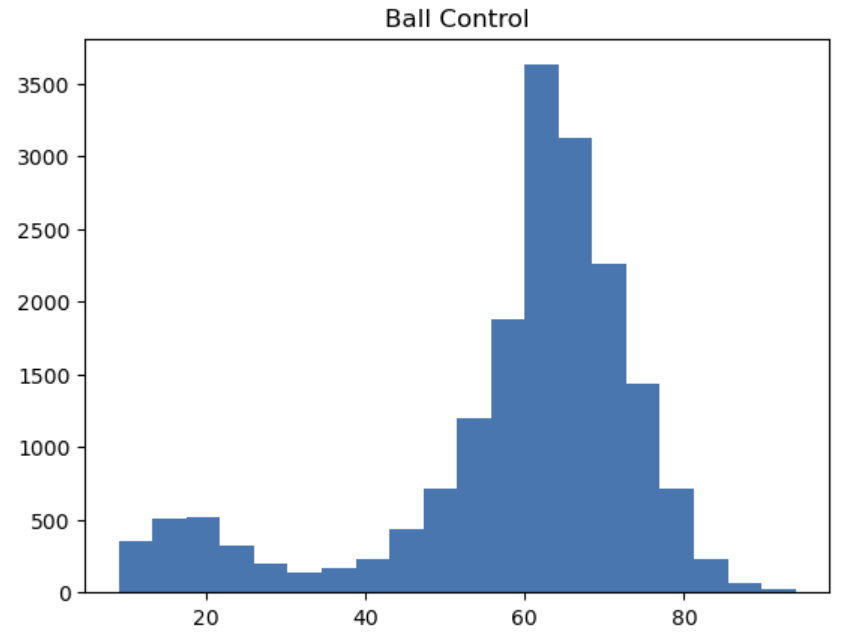
  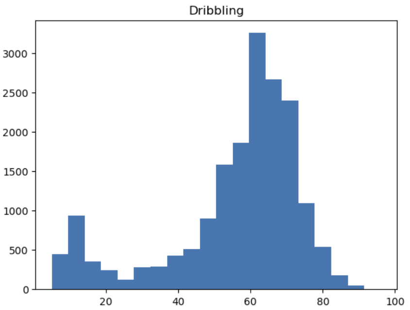
  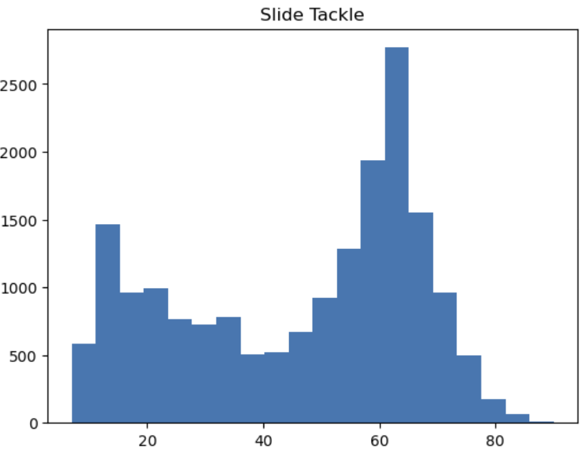
  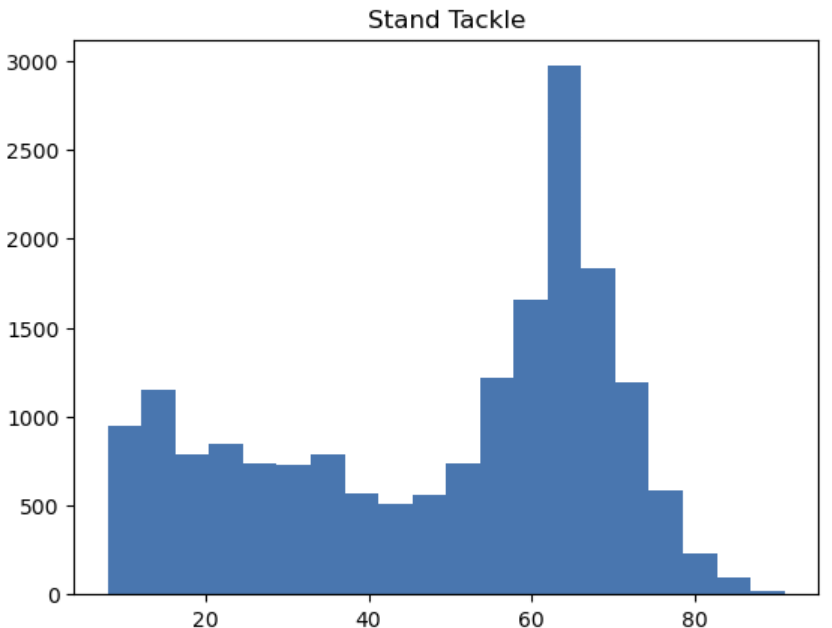

  <em>Figure 10–13: Bimodal distributions of key technical features leading to binary encoding.</em>

Finally, values below the thresholds were replaced with a constant (-1) to separate the peaks, and the remaining values were standardized using RobustScaler to handle outliers and ensure consistent scaling.

Several categorical features were explored and preprocessed for consistency in modeling. The "Preferred Position" feature was numerically encoded after examining the frequencies of each position using value_counts(). Missing values in the "Date of Contract Expiration" were imputed with the mean of non-missing expiry years, while invalid or missing "Joining Club Date" years were replaced with the average joining year. Additionally, a new feature, "Tenure at Club," was created from these two, representing loyalty and club investment, which may influence a player's value.

This concludes the data exploration and preprocessing phase. Using XGBoost, the top 20 features for predicting wages (Figure 14) were identified, achieving an MSE of 76.73 and an R2 of 0.77, reflecting improvements after preprocessing. The data was then split into 80% training and 20% test sets for modeling.

  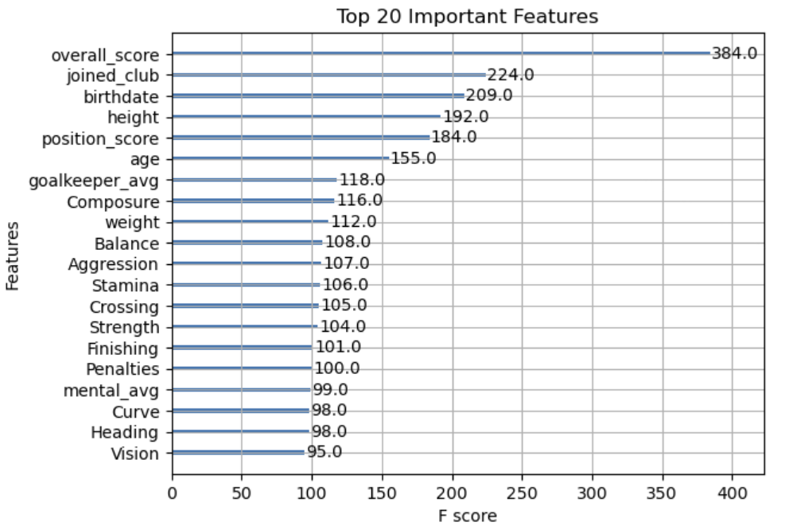

  <em>Figure 14: Top 20 Important Features by XGBoost After Preprocessing.</em>

## 🧠 Modeling & Results

After analyzing and preprocessing the data, we proceeded to the modeling stage. The independent variables include the top 20 most important features identified using XGBoost, with wage as the dependent variable. Since wage is a continuous variable, we applied linear regression, random forest, and Epsilon-Support Vector Regression (SVR) for prediction modeling.

| Model            | Preprocessing | MSE     | R² Score |
|------------------|---------------|---------|----------|
| **XGBoost**       | Before        | 90.91   | 0.73     |
|                  | After         | 76.73   | 0.77     |
| **Linear Regression** | Before    | 202.77  | 0.39     |
|                  | After         | 230.84  | 0.31     |
| **Random Forest** | Before        | 109.73  | 0.67     |
|                  | After         | 82.80   | 0.75     |
| **SVR**           | Before        | 105.46  | 0.68     |
|                  | After         | 77.07   | 0.77     |

**1. Linear Regression**

Linear Regression is simple and interpretable, allowing feature coefficients to directly reflect their impact on wages. However, its linearity assumption limits its performance when relationships, like age and wages, are non-linear. For example, younger players may have higher wages due to potential, but this can plateau or decline with age, which Linear Regression fails to capture accurately.

When applying Linear Regression to the processed data, we achieved an R2 score of 0.39 and an MSE of 202.77. However, after feature selection using XGBoost, the R2 score dropped to 0.31, and the MSE increased to 230.84. This outcome contrasts with the improved performance observed in the XGBoost model itself. These inconsistencies highlight the limitations of Linear Regression and motivated us to explore other models better suited for identifying the most influential factors.

**2. Random Forest**

Random Forest model was used to predict football player wages because of its ability to handle high-dimensional datasets and reduce overfitting through ensemble learning. The model was configured with 100 decision trees (n_estimators=100) and a fixed random state (random_state=42) to ensure reproducibility. The results indicate that the top 20 features after preprocessing performed better, achieving a lower MSE (82.80) and a higher R2 score (0.75) compared to the features before preprocessing (MSE: 109.73, R2: 0.67).

Despite slight differences in feature rankings between the two configurations, the most influential features remained consistent, reflecting their importance in determining player wages. However, the relatively low R2 values suggest that the current features may not fully capture the variability in wages, highlighting the need for further feature engineering and additional data sources.

The comparison underscores the importance of preprocessing in improving model accuracy and highlights the critical role of feature selection. While preprocessing enhanced the Random Forest model's predictive performance, future work should focus on incorporating richer data and refining feature engineering to better capture the complexities influencing player wages.

**3. Epsilon-Support Vector Regression (SVR)**

SVR’s objective is to find a function that best fits the data by ensuring that the errors are within a certain margin, specified by a parameter ε. The model tries to approximate the target variable as closely as possible while allowing some tolerance for errors, rather than trying to minimize every single error. SVR’s advantages include effectiveness in high-dimensional spaces when using non-linear kernel functions (in this case, we used “RBF: Radial Basis Function” as the kernel) and robustness to outliers due to the use of the margin of tolerance ε. Meanwhile, SVR is computationally expensive in order to store support vectors in high-dimensional spaces.

The model results in improvement from the using the dataset without data preprocessing. Out of the two feature sets selected by XGBoost , the set after preprocessing has a better R2 compared to features before preprocessing while also minimizing more MSE. Preprocessed features have “overall_score” as the most important feature while non-preprocessed features have several technical skills as the most important features.

## 📝 Conclusion and Future Improvements

The following project successfully predicted football player wages using a comprehensive dataset scraped from FIFA, incorporating essential attributes that capture player performance, physical characteristics, and career-related metrics. Robust data preprocessing, including handling missing values, encoding categorical variables, and transforming skewed distributions, was done to improve the quality of the data and the accuracy of the model significantly. Feature engineering further enriched the dataset with meaningful variables like Age, Tenure at Club, and Market Value Ratio, while the dimensionality reduction using XGBoost retained only the most relevant features. Among the various models explored, XGBoost performed the best due to its strengths in handling high-dimensional data and finding key influencing factors that led to better predictive accuracy. Despite its limitations, the model provides valuable insights for wage negotiations, player recruitment, and talent identification, even without considering external factors like sponsorships or team performance. Expanding the dataset and using advanced ensemble techniques can further improve accuracy. This highlights the potential of machine learning in football analytics, offering actionable insights for clubs, analysts, and stakeholders.
